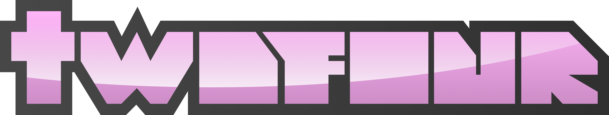

**TwoFour** is a community-driven project focused on replicating the legacy 2014/2016 **Roblox experience**. We're dedicated to recreating the nostalgic look and feel of the classic **Roblox** clients, complete with their iconic features and design.

## 

 - [web](https://github.com/TWO-FOUR-INC/twofour-trunk) - Built with SvelteKit, where you can interact with the community and access user-like features.
   - [arbiter](#) - TwoFour's Arbiter is a Node.js terminal app for hosting and managing TwoFour game servers.

 
